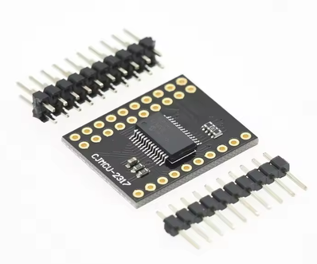
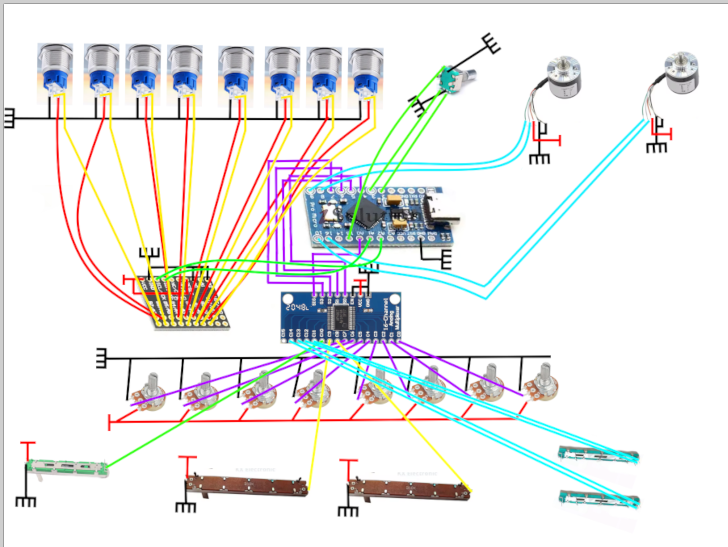

# June 20: Defining system requirements and main BOM:
- 1 * MCP23017 (https://fr.aliexpress.com/item/1005006988728405.html) = 2.89€

- 2 * Incremental Rotary AB 2 (600P) (https://fr.aliexpress.com/item/32877702646.html) = 2 * 14.19 = 28,38€
- 1 * EC11 (https://fr.aliexpress.com/item/1005001423308166.html) = 2.42€
- 8 * WH148 (https://fr.aliexpress.com/item/1005006271589247.html) = 2 * 1.60 = 3.2€
- 2 * B10K 75MM (https://fr.aliexpress.com/item/1005010291663713.html) = 5.89€
- 1 * Sliding Potentiometer 60mm (https://fr.aliexpress.com/item/1005007012174982.html) = 1.05€
- 2 * Slider B10K 75mm (https://fr.aliexpress.com/item/1005008114366506.html) = 3.59€
- 1 * Arduino Pro Micro Development Board (https://fr.aliexpress.com/item/1005011977174120.html) = 5.29€
- 8 * Button Push (https://fr.aliexpress.com/item/1005009242656603.html) = 8 * 2.84€ = 22,72€
- 1 * CD74HC4067 (https://fr.aliexpress.com/item/1005008792100593.html) = 1.42€

For fixed expense and fees:
= 116,41€ arround $131,61

Additionnal fees like: 
- 3d printer filament (reimbursed from forge)
- Wires (https://fr.aliexpress.com/item/1005007582092435.html) = 1.24€
- Tin () = 3.09€
- Cable Shrink Thermoretractile (https://fr.aliexpress.com/item/1005010130826093.html) = 2.19€

arround +6,52€ arround 7,47$

Arround 145$ with fees of shipping

Why adding MCP23017 and CD74HC4067 ?
> Because arduino pro micro havent enough PIN

**Total time spent: 3 hours**

# June 21: Electrical scheme:

This is the electrical scheme make me around 4H30 for make, remake, ...
Always problems:
- No enough pin -> remake all for adding extension card or reorgazine
- GND & VCC connections
...

**Total time spent: 4 hours**

# June 22: Software reflection

I need to make reflection about software,

Dj turntable need to be connected with an USB table to PC and configured in virtual DJ.
We need to go in Preferences > Controller > MIDI > Add Controller > Other / Unkown > Select USB Port > Edit > [assign all key in virtual dj key]

We need to install in software: MIDIArduino for be detected from the PC

I've test with an other ESP card at home but It's very difficult to be detected in PC (maybe because I've ESP-WROOM-32 ?)

**Total time spent: 1 hours 15 minutes**